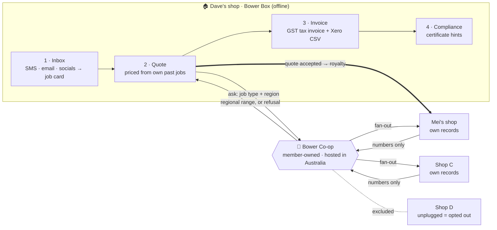

# Bower

### The AI your shop owns — not rents.

**A fair go for small business in the AI economy.**

[**🌐 Project page**](https://jiachenzhao2026.github.io/bower/) · [How it works](#how-it-works) · [Co-op rules](#the-co-op-rules) · [Status](#status)

---

## The challenge

> *"Over 97% of Australian businesses are small businesses and almost every AI tool they use is rented from overseas, with their data following it offshore."*
> — SMEC AI, **Makers, not takers — the Sovereign SME Challenge** (FEIT Hackathon Festival 2026)

Take a two-person plumbing shop. On a Monday:

- job requests arrive across **SMS, email and socials**
- every **quote** is rebuilt by hand, late at night
- then come **invoices** and **compliance paperwork**
- and staff paste customer details into **public chatbots**

Meanwhile the shop's most valuable know-how (years of real line items, labour hours and local prices) either sits in a shoebox or ends up feeding someone else's AI.

## What Bower gives back

| | | |
|---|---|---|
| 🏠 **Own the AI** | **🔒 Own the data** | **📈 Own the upside** |
| Bower Box runs on the shop's own laptop or a small office computer. **Inbox → Quote → Invoice → Compliance**, fully offline. | A **federated co-op**: shops answer each other's price questions from their own machines. There is no central database, and only regional ranges leave a shop. | When your past jobs help another shop's **accepted** quote, you earn a **per-use licence royalty**, traced line by line on a ledger. |

## How it works

1. **Ask.** The shop's box asks the co-op about a *job type in a region*. No customer details are sent.
2. **Fan-out.** The co-op forwards the question to member shops.
3. **Numbers only.** Each shop's own box answers with derived figures (price, hours, categories). Raw records never leave a shop.
4. **Range or refusal.** The co-op returns a historical regional range only if the rules below are met. Otherwise it refuses.
5. **Royalty.** When the requesting shop accepts its quote, the contributing shops earn a per-use royalty.

**AI reads and writes. Maths prices. The owner decides.** The language model only extracts job details and drafts wording. Every dollar figure comes from real historical data using deterministic code.

## The co-op rules

These rules are designed to keep price benchmarking historical, aggregated and anonymous:

| Rule | Why |
|---|---|
| **≥ 5 different businesses** behind every range | No single shop can be identified |
| Only jobs **≥ 90 days old** | Historical data, never live pricing |
| **No business > 25 %** of the weight | No one dominates the benchmark |
| **Regional ranges only** (P25–P75), **never a recommended price** | Reference, not coordination |
| Same ranges visible to **customers** too | Fair for households as well as tradies |
| Not enough data → **refuse** | Silence beats a leak |

Customer personal information is scrubbed **on the contributor's own device** before anything is shared. A contributor can **untick or unplug** at any time to stop sharing immediately. Statutory business records stay on their own machine.

## Sovereignty by design

- 🧠 **Open-weight models run locally** through Ollama with cloud features disabled.
- 🚫 **No offshore AI APIs** and **zero public-internet connections** at runtime, shown live by a built-in egress monitor.
- 🏠 **Owned, not rented.** It runs on the shop's existing laptop or a one-off office box.
- 🤝 **Member-owned co-op**, hosted in Australia, that only ever sees aggregated numbers.

## Tech stack

| Layer | Tools |
|---|---|
| Local AI | Ollama · Qwen2.5 (7B / 3B, open weights) · nomic-embed-text |
| App | Python 3.12 · FastAPI · Jinja2 + HTMX · SQLite · NumPy |
| Co-op | Same codebase in `node` / `aggregator` roles · signed fan-out · double-entry royalty ledger |
| Sovereignty | Outbound allow-list · egress monitor · local-only model server |

## Status

🚧 **Being built live at the FEIT Hackathon Festival 2026** (29 Sep – 1 Oct). This table is updated as features land.

| Component | What it does | Status |
|---|---|---|
| Inbox | Messy SMS / email / social text → structured job card | ⏳ Planned |
| Quote | Itemised draft priced from the shop's own past jobs | ⏳ Planned |
| Co-op query | Federated fan-out → regional range, or refusal | ⏳ Planned |
| Royalty ledger | Accepted quote → per-use royalty split (simulated) | ⏳ Planned |
| Invoicing & compliance | ATO tax-invoice fields, Xero CSV, compliance hints | ⏳ Planned |
| Sovereignty monitor | Public-internet connections: 0 | ⏳ Planned |

**MVP by Day 3:**
- an offline co-op running on several laptops over a no-internet LAN;
- the full Monday loop in under two minutes;
- a local staff assistant;
- one-click start with phone access by QR;
- measured evidence.

> All demo data is **synthetic**. Nothing here is legal, tax or pricing advice.

## Team

**Choosing a name is so difficult** · FEIT Hackathon Festival 2026, University of Melbourne

## Hackathon compliance

- Every line of this project was created during the hackathon's allocated build time. No pre-existing code was used.
- All third-party materials, models and tools are listed in [`THIRD_PARTY.md`](THIRD_PARTY.md).

## Licence

© 2026 the Bower team. All rights reserved until the team selects a licence. The source is public for hackathon judging.
