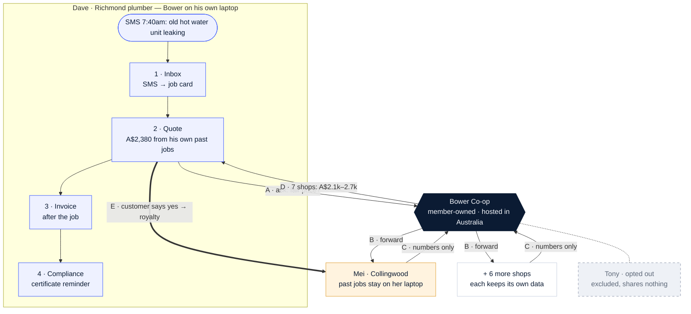

# Bower

### The AI your shop owns — not rents.

**Bower** is an AI assistant that runs entirely on a small business's own computer, plus a **co-op** that lets shops share price knowledge without sharing their data.

[**Project page**](https://jiachenzhao2026.github.io/bower/) · [A typical Monday](#how-it-works--a-typical-monday) · [Co-op rules](#the-co-op-rules) · [Status](#status)

---

## The challenge

> *"Over 97% of Australian businesses are small businesses and almost every AI tool they use is rented from overseas, with their data following it offshore."*
> — SMEC AI, **Makers, not takers — the Sovereign SME Challenge** (FEIT Hackathon Festival 2026)

A two-person plumbing shop's Monday looks like this:

- job requests arrive across **SMS, email and socials**;
- **prices are guessed** late at night, especially for jobs they rarely do;
- **invoices and compliance paperwork** pile up;
- customer details get pasted into **public chatbots**.

## What Bower gives back

| 01 · Own the AI | 02 · Own the data | 03 · Own the upside |
|---|---|---|
| Runs on the shop's **own laptop**: messages → quotes → invoices → compliance. **No cloud AI.** | Shops ask *"what do others charge?"* and answer from their own machines. **Raw records never leave.** | When your past jobs help another shop price a job, you **earn a small per-use royalty**. |

## How it works — a typical Monday

> Illustrative example with synthetic demo data.

At 7:40am Dave, a plumber in Richmond, gets an SMS: *"Old hot water unit leaking — replace this week?"* He rarely does this job.

- **In Dave's shop (steps 1–4).** Bower turns the SMS into a job card (1). It drafts a **A$2,380** quote from Dave's own past jobs (2). After the job it produces the invoice (3). It also reminds him that a Victorian plumbing compliance certificate is needed, because the job is over A$750 (4).
- **Through the co-op (steps A–E).** Before sending the quote, Dave checks what is fair locally:
  - **A.** Dave's laptop asks the co-op: *"hot-water replacement, inner Melbourne — fair price?"* No customer details are sent.
  - **B.** The co-op forwards the question to member shops.
  - **C.** Each shop's own laptop replies with **numbers only**.
  - **D.** Seven shops qualify, so the co-op returns a range of **A$2.1k–2.7k**. Dave's A$2,380 fits. With fewer than 5 shops it would refuse.
  - **E.** The customer says yes. Contributing shops such as Mei in Collingwood each earn a small royalty (A$0.24 here, simulated). Tony has left the co-op, so his shop is excluded and shares nothing.

**AI reads and writes. Maths prices. The owner decides.** The language model only turns messages into job cards and drafts wording. Every dollar figure comes from real historical records, calculated by ordinary code.

## The co-op rules

The rules keep shared price data historical, aggregated and anonymous. They will be enforced in code, not left to policy.

| Rule | Why it exists |
|---|---|
| **≥ 5 different shops** behind every range, or no answer | No single shop can be identified |
| Only jobs finished **90+ days ago** | Historical data, never live pricing |
| **No shop above 25 %** of the data | No one dominates the benchmark |
| A **regional range**, never a recommended price | Reference for the owner, not coordination |
| Same ranges visible to **customers** | Fair for households as well as tradies |
| Customer details removed **on the shop's own laptop** first | Personal information never leaves the shop |

## Sovereignty by design

- **Open-weight models** (AI models you download and run yourself) **run locally** through Ollama, a free app for running AI on your own computer. Its cloud features are disabled.
- **No cloud AI and no data sent offshore.** A built-in check will list every internet connection the app makes (target: zero).
- **Demo setup:** shops run on laptops over local Wi-Fi with no internet. A real co-op server would be hosted in Australia.
- **Leave any time.** A shop that leaves the co-op is excluded instantly, and its own business records stay on its machine.

## Tech stack

| Layer | Tools |
|---|---|
| Local AI | Qwen2.5 open model (7B; 1.5B for low-spec laptops) · Ollama · nomic-embed-text |
| App | Python 3.12 · FastAPI · Jinja2 + HTMX · SQLite · NumPy |
| Co-op | Each shop runs a *node*; the co-op runs an *aggregator* that combines answers · signed queries · royalty ledger |

## Status

**Being built live at the FEIT Hackathon Festival 2026** (29 Sep – 1 Oct, University of Melbourne). This table is updated as features land.

| Component | What it does | Status |
|---|---|---|
| Inbox | SMS / email / socials → one job list | ⏳ Planned |
| Quote | Priced from the shop's own past jobs | ⏳ Planned |
| Co-op query | Asks member shops → range or refusal | ⏳ Planned |
| Royalty ledger | Accepted quote → royalty split (simulated) | ⏳ Planned |
| Invoicing | Tax invoice + compliance reminders | ⏳ Planned |
| Sovereignty | Live check of internet connections | ⏳ Planned |

**MVP by hackathon Day 3**

1. **Live co-op demo:** 9 shops on 4 laptops
2. **Full Monday loop** in under 2 minutes
3. **Staff assistant:** safe, local AI chat
4. **No IT needed:** one click, phone via QR
5. **Evidence:** timed trials with 6+ people

> All demo data is **synthetic**. Nothing here is legal, tax or pricing advice.

## Team

**Choosing a name is so difficult** · FEIT Hackathon Festival 2026, University of Melbourne. Entry for the SMEC AI challenge, also entering the SMEC Sovereign AI Award.

## Hackathon compliance

- Everything in this repository was created during the hackathon's allocated build time. No pre-existing code was used.
- All third-party materials, models and tools are listed in [`THIRD_PARTY.md`](THIRD_PARTY.md).

## Licence

© 2026 the Bower team. All rights reserved until the team selects a licence. The source is public for hackathon judging.
